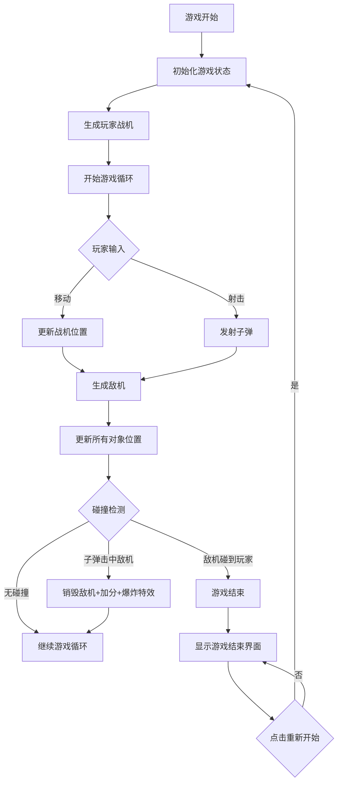

## 1. 产品概述

一款经典的竖版卷轴射击游戏"飞机大战"，玩家操控战机在深空中躲避敌机并发射子弹消灭敌人。游戏采用霓虹几何风格视觉设计，提供流畅的射击体验和爆炸粒子特效。

- 主要用途：休闲娱乐，考验玩家反应能力和手眼协调
- 目标用户：喜欢经典街机射击游戏的玩家
- 产品价值：无需下载，即开即玩的轻量级网页游戏

## 2. 核心功能

### 2.1 用户角色

| 角色 | 说明 | 核心权限 |
|------|------|----------|
| 玩家 | 游戏操作者 | 控制战机移动、发射子弹、查看分数、重新开始游戏 |

### 2.2 功能模块

1. **游戏主界面**：游戏画布、实时分数显示、玩家战机、敌机群、子弹、背景星空
2. **游戏结束界面**：游戏结束标题、最终得分、重新开始按钮

### 2.3 页面详情

| 页面名称 | 模块名称 | 功能描述 |
|----------|----------|----------|
| 游戏主界面 | 玩家战机 | 使用键盘方向键或 WASD 控制移动，空格键发射子弹 |
| 游戏主界面 | 敌机生成 | 从屏幕顶部随机位置生成敌机，以不同速度向下移动，至少两种颜色变化 |
| 游戏主界面 | 碰撞检测 | 子弹击中敌机→敌机销毁+10分+爆炸粒子特效；敌机碰到玩家→游戏结束 |
| 游戏主界面 | 分数显示 | 左上角实时显示当前得分 |
| 游戏主界面 | 背景星空 | 深空渐变背景（深蓝到紫黑），随机闪烁的静态星星 |
| 游戏结束界面 | 结束提示 | 屏幕中央显示"游戏结束"大标题 |
| 游戏结束界面 | 重新开始 | 点击按钮重置所有状态，重新开始游戏 |

## 3. 核心流程

## 4. 用户界面设计

### 4.1 设计风格

- **主色调**：深空渐变背景（深蓝 #0a0e27 到紫黑 #1a0a2e）
- **玩家战机**：霓虹蓝/青色（#00ffff, #00ccff）几何三角箭头造型
- **敌机**：霓虹红/橙色（#ff3366, #ff6600）几何图形，至少两种颜色变化
- **子弹**：激光绿（#00ff66）细长矩形，带发光效果
- **爆炸特效**：粒子扩散效果，颜色从亮黄到橙红渐变
- **字体**：使用科技感等宽字体，分数显示带发光效果
- **按钮样式**：圆角矩形，霓虹边框，悬停时发光增强

### 4.2 页面设计概览

| 页面名称 | 模块名称 | UI 元素 |
|----------|----------|---------|
| 游戏主界面 | 背景 | 深空渐变 + 随机闪烁星星（白色小点，透明度变化） |
| 游戏主界面 | 玩家战机 | 霓虹蓝三角箭头，带青色发光边缘 |
| 游戏主界面 | 敌机 | 霓虹红/橙色倒三角或菱形，带发光效果 |
| 游戏主界面 | 子弹 | 激光绿细长矩形（4x12px），带绿色光晕 |
| 游戏主界面 | 分数显示 | 左上角，白色文字带蓝色发光，字号 24px |
| 游戏结束界面 | 标题 | "游戏结束"，白色大字，带红色发光效果 |
| 游戏结束界面 | 按钮 | "重新开始"，霓虹蓝边框，悬停时背景填充 |

### 4.3 响应式

- **桌面优先**：默认适配 1920x1080 分辨率
- **窗口适配**：监听 resize 事件，Canvas 自动调整大小
- **高分屏支持**：使用 devicePixelRatio 进行 Retina 适配，确保画面清晰
- **游戏区域**：保持竖版比例（如 9:16），居中显示

### 4.4 3D 场景指导

不适用（本游戏为 2D Canvas 渲染）
