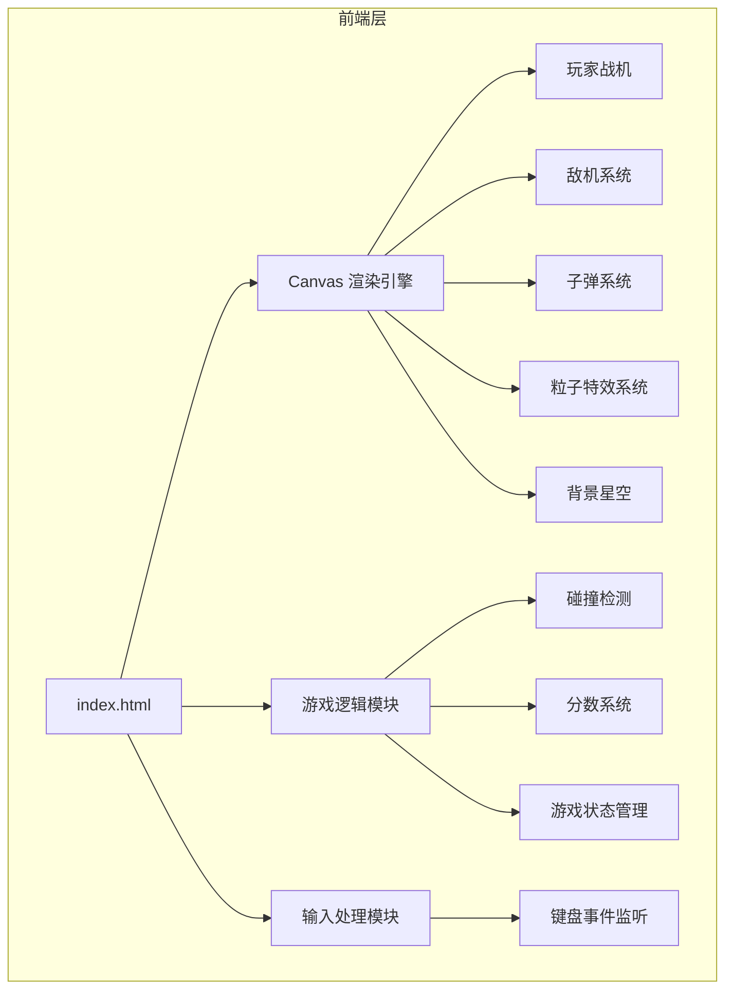

## 1. 架构设计



## 2. 技术说明

- **前端技术**：纯原生 HTML5 + CSS3 + JavaScript（ES6+）
- **渲染方式**：HTML5 Canvas 2D Context
- **游戏循环**：requestAnimationFrame 实现 60fps 流畅渲染
- **文件结构**：单文件架构（index.html），内联 CSS 和 JS
- **无外部依赖**：不使用任何第三方库或框架

### 核心技术点

1. **Canvas 高分屏适配**
   - 使用 `window.devicePixelRatio` 计算实际渲染分辨率
   - CSS 显示尺寸与 Canvas 实际像素分离
   - 上下文缩放以匹配设备像素比

2. **游戏对象管理**
   - 使用类（Class）定义 Player、Enemy、Bullet、Particle
   - 对象池模式管理活跃对象，避免频繁创建/销毁
   - 数组过滤移除已销毁对象

3. **碰撞检测**
   - 使用 AABB（Axis-Aligned Bounding Box）矩形碰撞检测
   - 子弹与敌机碰撞、敌机与玩家碰撞

4. **粒子特效系统**
   - 爆炸时生成 10-15 个粒子
   - 粒子具有随机速度、生命周期、颜色渐变
   - 每帧更新粒子位置并衰减透明度

5. **输入处理**
   - 监听 keydown/keyup 事件
   - 使用 Set 记录按键状态，支持多键同时按下
   - 防止方向键默认滚动行为

## 3. 路由定义

| 路由 | 说明 |
|------|------|
| / | 单页面应用，直接加载 index.html 即可运行游戏 |

## 4. API 定义

不适用（纯前端应用，无后端交互）

## 5. 服务器架构图

不适用（纯静态文件，无需后端服务器）

## 6. 数据模型

### 6.1 游戏状态数据结构

```javascript
// 游戏状态
GameState = {
  score: number,        // 当前分数
  isGameOver: boolean,  // 游戏是否结束
  player: Player,       // 玩家对象
  enemies: Enemy[],     // 敌机数组
  bullets: Bullet[],    // 子弹数组
  particles: Particle[],// 粒子数组
  stars: Star[]         // 背景星星数组
}

// 玩家对象
Player = {
  x: number,            // X 坐标
  y: number,            // Y 坐标
  width: number,        // 宽度
  height: number,       // 高度
  speed: number,        // 移动速度
  color: string         // 颜色
}

// 敌机对象
Enemy = {
  x: number,
  y: number,
  width: number,
  height: number,
  speed: number,        // 下落速度（随机）
  color: string,        // 颜色（红/橙随机）
  type: number          // 类型（1 或 2，决定形状）
}

// 子弹对象
Bullet = {
  x: number,
  y: number,
  width: number,
  height: number,
  speed: number,        // 上升速度
  color: string
}

// 粒子对象
Particle = {
  x: number,
  y: number,
  vx: number,           // X 方向速度
  vy: number,           // Y 方向速度
  life: number,         // 生命值（0-1）
  decay: number,        // 衰减速度
  color: string,
  size: number
}

// 星星对象
Star = {
  x: number,
  y: number,
  size: number,
  opacity: number,      // 透明度（闪烁效果）
  twinkleSpeed: number  // 闪烁速度
}
```

### 6.2 游戏参数配置

```javascript
CONFIG = {
  // 玩家配置
  PLAYER_SPEED: 5,
  PLAYER_SIZE: { width: 40, height: 50 },
  
  // 子弹配置
  BULLET_SPEED: 8,
  BULLET_SIZE: { width: 4, height: 12 },
  FIRE_INTERVAL: 200,  // 射击间隔（毫秒）
  
  // 敌机配置
  ENEMY_SPAWN_INTERVAL: 1000,  // 生成间隔（毫秒）
  ENEMY_SPEED_RANGE: { min: 2, max: 5 },
  ENEMY_SIZE: { width: 35, height: 40 },
  
  // 粒子配置
  PARTICLE_COUNT: 12,     // 每次爆炸粒子数
  PARTICLE_LIFE: 1.0,
  PARTICLE_DECAY: 0.02,
  
  // 分数配置
  SCORE_PER_KILL: 10,
  
  // 视觉配置
  STAR_COUNT: 100,
  BACKGROUND_GRADIENT: ['#0a0e27', '#1a0a2e']
}
```
